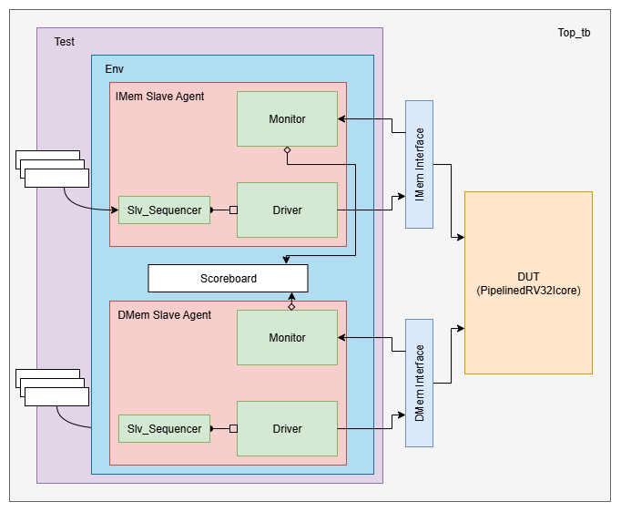
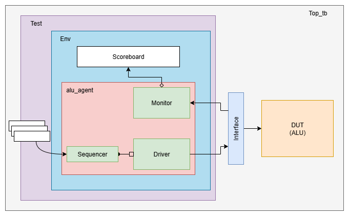

# RV32I Processor with riscv-tests supported UVM testbench

- This is a 5-stage pipelined riscv32i processor using chisel HDL.
- The UVM testbench capable of running [riscv-software-src/riscv-tests](https://github.com/riscv-software-src/riscv-tests)
- Extra UVM testbench to verify the ALU functionality (for learning purposes)


## Requirements
- Scala CLI ([How to install](https://www.chisel-lang.org/docs/installation))
- Xilinx Vivado Design Suite (Tested on versions 2022.2, 2020.1)
- riscv-tests ([git repo](https://github.com/riscv-software-src/riscv-tests))
  - Need a modified version without privilege instructions.
  - Follow [this readme](riscv-tests_modified_files/README.md) to patch riscv-tests repo.

## How to compile
```
git clone git@github.com:tharinduSamare/RV32_processor.git
cd ./RV32_processor
sbt run # Generate verilog from Chisel code inside generated-src folder
```

## How to run uvm testbench on rv32i_processor

- In `src/test/sv/uvm/top/tb_config_pkg.svh`
  - set `RISCV_TESTS_DIR` to `<riscv-test-repository path>/isa`
  - set the necessary tests in `TESTS[]` array.
- In `src/test/sv/uvm/build.tcl`
  - Set the `UVM_VERBOSITY` to required level (`UVM_NONE`, `UVM_LOW`, `UVM_MEDIUM`, `UVM_HIGH`, `UVM_FULL`, `UVM_DEBUG`)
    - The higher the verbosity value, the more prints will be visible.
- Run vivado and in vivado TCL terminal 
```
cd RV32_processor/src/test/sv/uvm/
source ./build.tcl
```


## How to run uvm testbench on ALU
- In `src/test/sv/uvm/build.tcl` comment-out `RISCV-core tb` section and use `ALU tb` section.
- Run `build.tcl` in vivado as mentioned in previous section.



## How to simulate RV32_processor with the normal testbench in vivado
- Create vivado project
- Set generated-src/PipelinedRV32I.v as a design source
- Set following files as simulation sources
  - src/test/sv/pipelinedRISC32I_tb.sv
  - src/test/sv/uvm/top/tb_config_pkg.svh
  - src/test/sv/uvm/dmem_agent/dmem_if.sv
  - src/test/sv/uvm/imem_agent/imem_if.sv
- Change `tb_config_pkg.svh` file type as systemverilog in vivado file settings
- Run simulation

