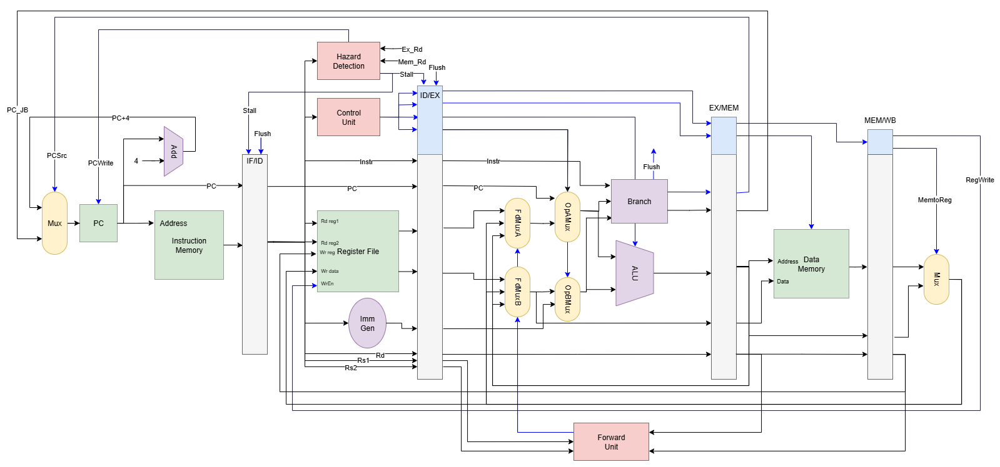

# TinyRiscV Processor with riscv-tests supported UVM testbench

- This is a 5-stage pipelined riscv32i processor using chisel HDL.
- This supports a sub-set of RV32UI instructions. ([Tiny RISC-V ISA](https://www.csl.cornell.edu/courses/ece6745/handouts/ece6745-tinyrv-isa.txt) + few more)
  - ADD, ADDI, MUL, ORI, SLLI
  - LW, SW
  - JAL, JR
  - BNE, BEQ
  - LUI, AUIPC
  UNIMP
- The UVM testbench capable of running [riscv-software-src/riscv-tests](https://github.com/riscv-software-src/riscv-tests)
- Extra UVM testbench to verify the ALU functionality (for learning purposes)



## Requirements
- Scala CLI ([How to install](https://www.chisel-lang.org/docs/installation))
- Xilinx Vivado Design Suite (Tested on versions 2022.2, 2020.1)
- riscv-tests ([git repo](https://github.com/riscv-software-src/riscv-tests))
  - Need a modified version only without csr instructions.
    - Available in frascati.eit.uni-kl.de server

## How to compile
```
git clone git@github.com:tharinduSamare/RV32_processor.git
cd ./RV32_processor
sbt run # Generate verilog from Chisel code inside generated-src folder
```

## How to run uvm testbench on rv32i_processor

- set RISCV_TESTS_DIR: repo path in RV32_processor/src/test/sv/uvm/top/tb_config_pkg.svh if it is different (don't need if run on frascati.eit.uni-kl.de server)
- In vivado TCL terminal
```
cd RV32_processor/src/test/sv/uvm/
source ./build.tcl
```

## How to run uvm testbench on ALU
- In RV32_processor/src/test/sv/uvm/build.tcl comment-out "RISCV-core tb" section and use "ALU tb" section.
- Run build.tcl in vivado as mentioned in previous section.

## How to simulate RV32_processor with the normal testbench in vivado
- Create vivado project
- Set generated-src/PipelinedRV32I.v as a design source
- Set following files as simulation sources
  - src/test/sv/pipelinedRISC32I_tb.sv
  - src/test/sv/uvm/top/tb_config_pkg.svh
  - src/test/sv/uvm/dmem_agent/dmem_if.sv
  - src/test/sv/uvm/imem_agent/imem_if.sv
- Change tb_config_pkg.svh file type as systemverilog in vivado file settings
- Run simulation

